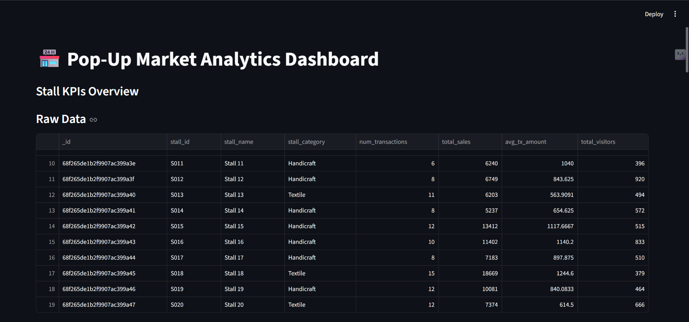
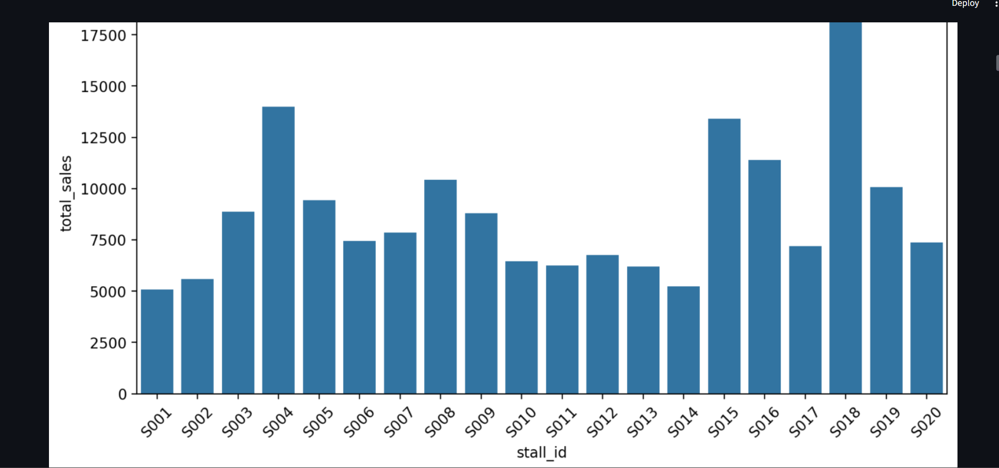
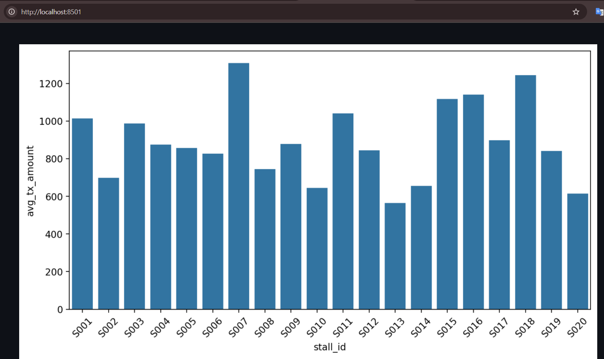
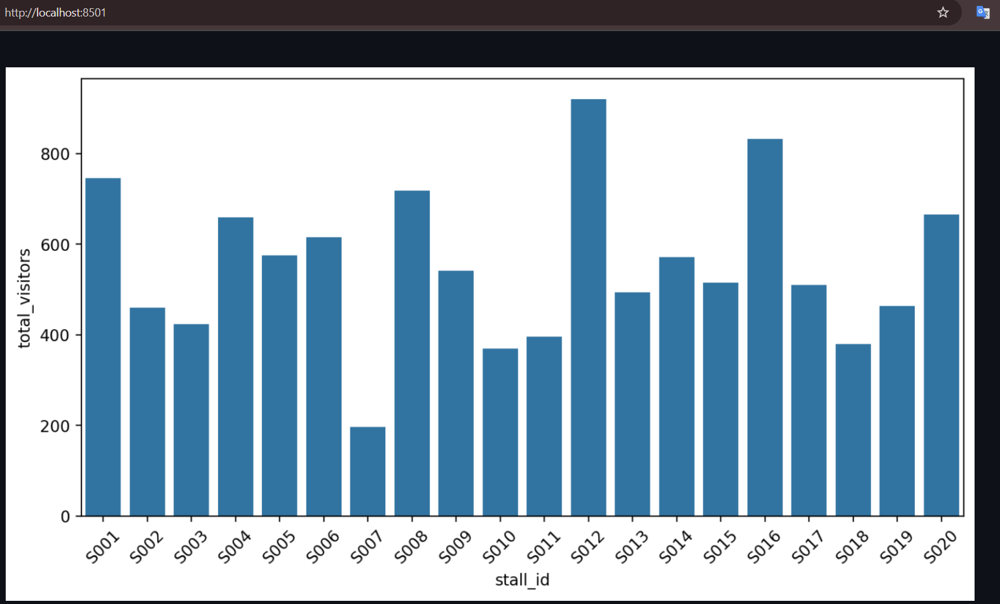

# Market Stalls Data Analysis

## Project Overview
This project analyzes **pop-up market stall data** to provide insights on stall performance, transactions, sales, and visitor footfall.  
It demonstrates a complete **ETL pipeline** with data ingestion, processing, storage, and visualization using **PySpark, MongoDB, and Streamlit**.

### Key Features
- ETL pipeline using **PySpark**  
- Storage of processed data in **MongoDB**  
- Interactive **Streamlit dashboard**  
- Visualizations using **Matplotlib** and **Seaborn**  
- KPIs: Total stalls, total transactions, total sales, total visitors  

## Project Structure
Footfall/
├── scripts/
│ ├── spark_etl_fast.py # PySpark ETL script
│ └── dashboard_app.py # Streamlit dashboard app
├── data/ # CSV datasets (stalls, transactions, footfall)
├── .venv/ # Virtual environment
└── README.md

## Pre-requisites
- **Python 3.10+**  
- **PySpark**  
- **MongoDB Community Server**  
- **Streamlit**  

**Required Python packages**:  
`pandas`, `matplotlib`, `seaborn`, `pymongo`, `streamlit`  

Install packages using:

```bash
pip install pandas matplotlib seaborn pymongo streamlit
Setup Instructions
1. Activate Virtual Environment
powershell
# Windows PowerShell
& ".\.venv\Scripts\Activate.ps1"

2. Start MongoDB
# If installed locally
mongod

3. Run ETL Script
python .\scripts\spark_etl_fast.py
This reads CSV datasets, processes them using PySpark, and stores the results in MongoDB (popups_analytics → stall_kpis).

4. Run Dashboard
streamlit run .\scripts\dashboard_app.py
Open your browser at http://localhost:8501

Dashboard Features
Raw data table

Key KPIs summary

Visualizations:

Total sales per stall

Average transaction amount per stall

Total visitors per stall

### Dashboard Screenshots samples

#### 1. Raw Data Table


#### 2. Total Sales per Stall


#### 3. Average Transaction Amount per Stall


#### 4. Total Visitors per Stall



Dataset
Stalls CSV: Stall metadata (stall_id, name, category)

Transactions CSVs: Transaction logs (stall_id, tx_id, quantity, amount)

Footfall CSVs: Visitor logs (stall_id, timestamp, visitors)

Note: The project uses synthetic datasets for demonstration.

Technologies Used
PySpark – Big data processing

MongoDB – NoSQL database for storing processed KPIs

Streamlit – Dashboard and visualization

Matplotlib & Seaborn – Charts and plots

ETL Workflow
Read raw CSV datasets using PySpark

Clean and process data (aggregate KPIs, calculate averages)

Write processed data to MongoDB

Fetch data from MongoDB in the dashboard

Display interactive charts and KPIs

Sample MongoDB Queries
javascript
Copy code
// View all stalls
db.stall_kpis.find()

// Top 5 stalls by total visitors
db.stall_kpis.find().sort({total_visitors: -1}).limit(5)

// Check sales of a specific stall
db.stall_kpis.find({stall_id: "S101"}, {total_sales: 1})
Learning Outcomes
Building an end-to-end ETL pipeline

Working with PySpark for big data processing

Using MongoDB as a NoSQL storage solution

Creating interactive dashboards with Streamlit

Visualizing KPIs with Matplotlib & Seaborn

Author
Siddhi Ghode
Email: siddhighode05@gmail.com
LinkedIn: linkedin.com/in/siddhi-ghode-25901a286
